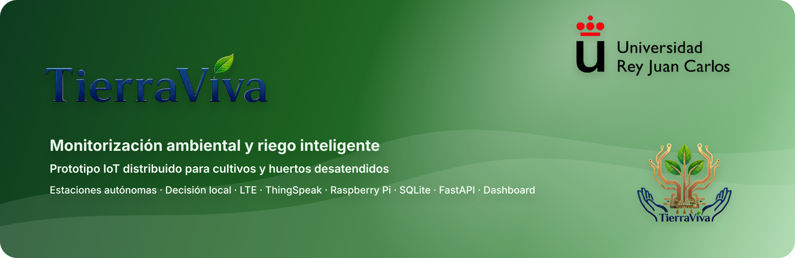
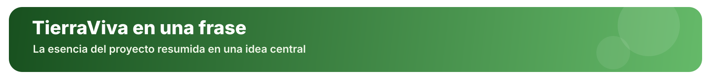
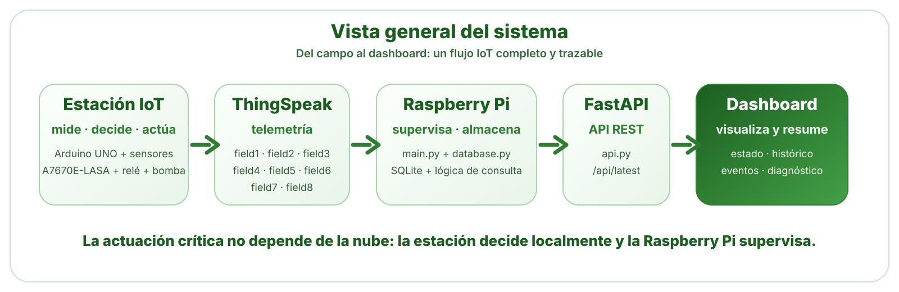
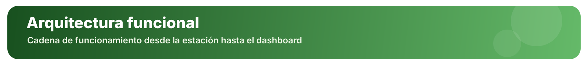
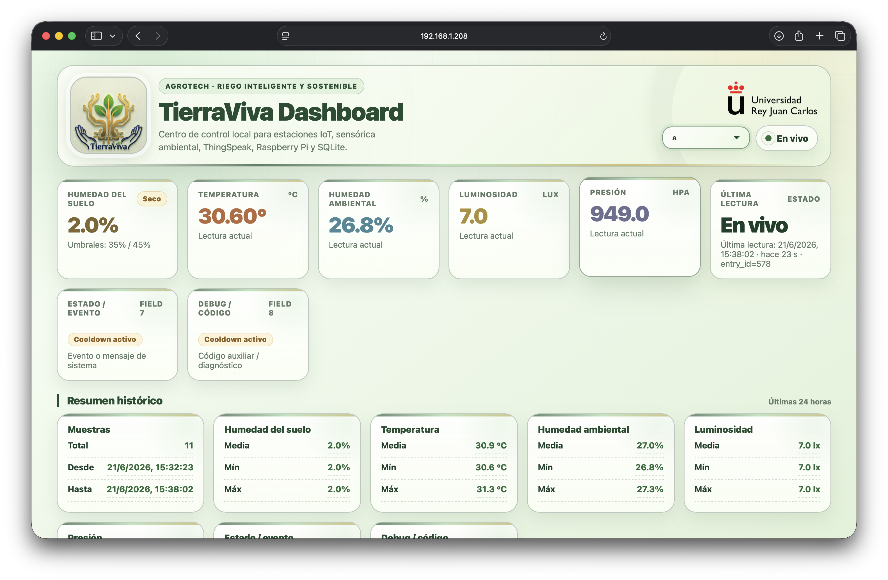
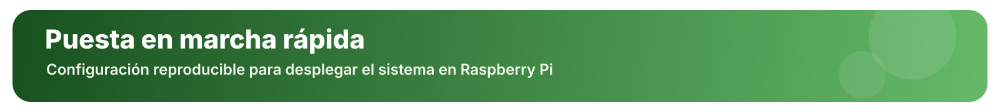
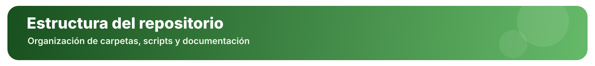

<p align="center">
  
</p>

<h3 align="center">
  Prototipo IoT distribuido para supervisar el entorno, registrar telemetría y apoyar el riego con criterio de ingeniería
</h3>

<p align="center">
  
  
  
</p>

<p align="center">
  
  
  
  
  
  
</p>

<p align="center">
  
</p>


<p align="center">
  
</p>

> **TierraViva es un sistema IoT de monitorización ambiental y riego inteligente en el que la actuación crítica se decide localmente en cada estación, mientras que la Raspberry Pi se encarga de supervisar, almacenar, exponer y visualizar la información.**


<p align="center">
  
</p>

**TierraViva** es un prototipo IoT concebido para pequeños cultivos, huertos o espacios agrícolas que no pueden supervisarse de forma presencial continua.

El proyecto aborda una necesidad muy concreta:  
**conocer qué está ocurriendo en el entorno de cultivo, registrar la evolución de sus variables y actuar con seguridad cuando el suelo realmente lo requiere**.

Para ello, integra en un único sistema:

- **estaciones remotas autónomas** basadas en Arduino;
- **sensórica ambiental y de suelo**;
- **comunicación LTE** mediante A7670E-LASA;
- **publicación de telemetría en ThingSpeak**;
- **ingesta y almacenamiento local en Raspberry Pi**;
- **API REST con FastAPI**;
- **dashboard web de supervisión**;
- **documentación técnica, validación y trazabilidad**.

No es solo una maqueta con sensores: es un **prototipo funcional completo**, concebido como un sistema de ingeniería de extremo a extremo.

<p align="center">
  
</p>

Esto significa que cada estación:

1. **mide** sus variables;
2. **interpreta** las condiciones locales;
3. **decide** si debe actuar;
4. **actúa** mediante relé y bomba de agua;
5. **publica** telemetría, estado y diagnóstico.

La Raspberry Pi **no envía órdenes de riego**.  
Su papel es **supervisar**, **almacenar histórico**, **servir la API** y **hacer visible el comportamiento del sistema**.

Esta separación es una de las decisiones más importantes del proyecto, porque evita que una caída de la supervisión o una incidencia en la conectividad provoquen una actuación física incoherente.


<p align="center">
  
</p>

<table>
  <tr>
    <td width="25%" align="center">
      <h3>🌱 Problema real</h3>
      <p>Parte de una necesidad concreta en pequeños cultivos desatendidos: observar el entorno y apoyar el riego sin depender de presencia física continua.</p>
    </td>
    <td width="25%" align="center">
      <h3>🧠 Criterio de ingeniería</h3>
      <p>La arquitectura evita delegar la decisión crítica en la nube y sitúa la actuación donde está el hardware.</p>
    </td>
    <td width="25%" align="center">
      <h3>🔗 Sistema completo</h3>
      <p>No se limita al nodo sensórico: integra comunicaciones, almacenamiento, API, dashboard, validación y documentación.</p>
    </td>
    <td width="25%" align="center">
      <h3>📘 Documentación técnica</h3>
      <p>Incluye memoria técnica, anexos, trazabilidad, manuales, justificación de decisiones y validación por bloques.</p>
    </td>
  </tr>
</table>


<p align="center">
  
</p>

<p align="center">
  
</p>

| Capa | Elementos | Función principal |
|---|---|---|
| **Estaciones remotas** | Arduino UNO, BME280, BH1750, sensor de humedad de suelo, A7670E-LASA, relé, bomba 12 V | Medición, decisión local y actuación |
| **Telemetría** | ThingSpeak | Recepción y consulta de datos |
| **Supervisión** | Raspberry Pi + `main.py` + `database.py` | Ingesta, normalización y persistencia |
| **Backend** | `api.py` con FastAPI | API REST y servicio del frontend |
| **Visualización** | `dashboard/` | Consulta de estado, histórico y diagnóstico |

<p align="center">
  
</p>


TierraViva puede entenderse como una cadena funcional muy clara:

```text
[ Estación remota ]
   ├─ Sensores: suelo, temperatura, humedad, luz y presión
   ├─ Evaluación local de condiciones
   ├─ Actuación mediante relé y bomba
   └─ Publicación LTE → ThingSpeak

[ Raspberry Pi ]
   ├─ Consulta periódica a ThingSpeak
   ├─ Normalización de datos
   ├─ Almacenamiento en SQLite
   ├─ API REST con FastAPI
   └─ Servicio del dashboard web

[ Usuario ]
   └─ Consulta estado, histórico, eventos y diagnóstico desde navegador
```


<p align="center">
  
</p>

Cada estación publica sus medidas y estado con la siguiente estructura:

| Campo    | Variable interna    | Descripción                    |
| -------- | ------------------- | ------------------------------ |
| `field1` | `soil_moisture_pct` | Humedad de suelo normalizada   |
| `field2` | `temperature_c`     | Temperatura ambiente           |
| `field3` | `humidity_pct`      | Humedad relativa ambiental     |
| `field4` | `light_lux`         | Luminosidad                    |
| `field5` | `pressure_hpa`      | Presión atmosférica            |
| `field6` | `relay_state`       | Estado del relé                |
| `field7` | `system_event`      | Evento operativo               |
| `field8` | `debug_code`        | Código auxiliar de diagnóstico |


<p align="center">
  
</p>

El dashboard de supervisión permite consultar de forma clara:

* última lectura disponible de cada estación;
* humedad del suelo y variables ambientales;
* estado del relé;
* evento operativo y código de diagnóstico;
* evolución reciente de las mediciones;
* histórico almacenado;
* frescura de los datos.

<p align="center">
  
</p>

<p align="center">
  
</p>
<details>
<summary><strong>Ver pasos de instalación</strong></summary>

### 1. Clonar el repositorio

```bash
git clone https://github.com/ltejedorcruz/TierraViva.git
cd TierraViva
```

### 2. Preparar el fichero de configuración

```bash
cp .env.example .env
nano .env
```

Completa, al menos, los canales y claves de lectura de ThingSpeak:

```env
THINGSPEAK_CHANNEL_A=
THINGSPEAK_READ_KEY_A=
THINGSPEAK_CHANNEL_B=
THINGSPEAK_READ_KEY_B=
```

### 3. Instalar dependencias y preparar el entorno

```bash
chmod +x tierraviva.sh
./tierraviva.sh install
```

Este script:

* crea el entorno virtual;
* instala dependencias Python;
* prepara la base de datos SQLite;
* sincroniza el dashboard en `frontend/`.

### 4. Arrancar el sistema

```bash
./tierraviva.sh start
```

### 5. Acceder al dashboard y la API

Dashboard local:

```text
http://127.0.0.1:8000
```

Ejemplo de consulta a la API:

```bash
curl "http://127.0.0.1:8000/api/latest?station=A"
```

</details>


<p align="center">
  
</p>


| Endpoint                                | Descripción                                |
| --------------------------------------- | ------------------------------------------ |
| `GET /`                                 | Dashboard web                              |
| `GET /api/config`                       | Configuración visible por el frontend      |
| `GET /api/latest?station=A`             | Última lectura de una estación             |
| `GET /api/readings?station=A&limit=120` | Histórico reciente                         |
| `GET /api/stats?station=A&hours=24`     | Resumen estadístico                        |
| `GET /api/health`                       | Estado básico de la API y la base de datos |


<p align="center">
  
</p>

```text
.
├── api.py                          # API FastAPI y servicio del dashboard
├── database.py                     # Persistencia y consultas SQLite
├── main.py                         # Ingesta periódica desde ThingSpeak
├── tierraviva.sh                   # Instalación, arranque y gestión del sistema
├── .env.example                    # Plantilla de configuración
├── requirements.txt                # Dependencias Python del proyecto
├── README.md                       # Presentación general del repositorio
│
├── dashboard/                      # Dashboard web de supervisión
│   ├── images/                     # Logo TierraViva, logo URJC y favicon
│   └── index.html                  # Interfaz principal del dashboard
│
├── docs/                           # Documentación auxiliar y recursos del README
│   ├── assets/                     # Assets gráficos del README
│   ├── Circuit_Documentation_TierraViva.pdf
│   └── logs_arduino_estacionA.txt
│
├── Estacion/                       # Firmware final de las estaciones remotas
│   ├── Estacion_A_final_Plus/      # Código Arduino de la estación A
│   └── Estacion_B_final_Plus/      # Código Arduino de la estación B
│
├── memoria/                        # Memoria del TFG en LaTeX
│   ├── anexos/                     # Anexos técnicos, manuales y trazabilidad
│   ├── capitulos/                  # Capítulos principales de la memoria
│   ├── figs/                       # Figuras originales y recursos gráficos
│   ├── figs_png/                   # Figuras exportadas y capturas utilizadas
│   ├── portada/                    # Portada, resumen, prólogo e índices
│   ├── bibliografia.bib            # Bibliografía del trabajo
│   ├── estilo.tex                  # Configuración de estilo LaTeX
│   ├── memoria.tex                 # Documento principal de la memoria
│   └── memoria.pdf                 # Versión compilada de la memoria
│
└── prototipos/                     # Prototipos previos y pruebas de evolución
    ├── estacion_pruebas/           # Ensayos iniciales con A7670E y sensores
    └── prototipo_local_mqtt/       # Arquitectura previa basada en MQTT local
```

<p align="center">
  
</p>

La documentación completa del proyecto se encuentra en la carpeta `memoria/`.

La memoria incluye:

* introducción y estado del arte;
* requisitos, materiales y decisiones;
* arquitectura final;
* implementación hardware y firmware;
* implementación software;
* validación, resultados y discusión;
* manual de instalación;
* manual de usuario;
* manual API;
* glosario;
* trazabilidad requisitos-pruebas.


<p align="center">
  
</p>
